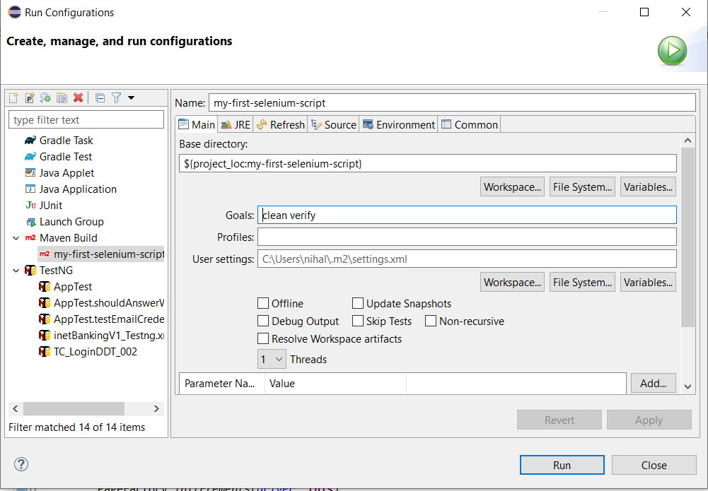

# Simple_Selenium_App
Validation of email field and login button upon entering the invalid email id with string "T3ST123" and checking the status of the login button

## Steps to run the AppTest.java file ##
1. Import the project into eclipse
2. After importing, right-click on pom.xml file and go to Run as > Run Configurations
3. Create Maven configuration as shown in the image below
 
4. Press Run 
5. Test will be executed 
